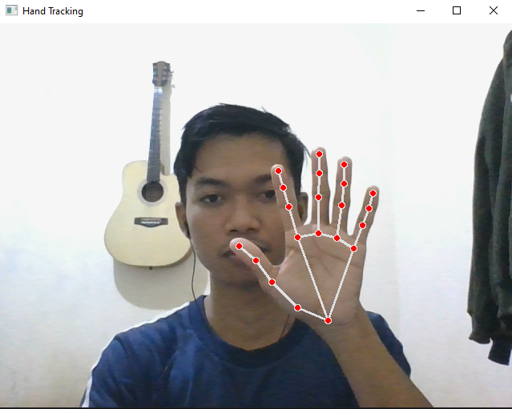

# 🖐 Real-Time Hand Tracking with MediaPipe and OpenCV

A simple real-time hand tracking application built using MediaPipe and OpenCV. This project tracks one or more hands from your webcam and visualizes **21 key landmarks**, including fingertips, knuckles, and wrist.

---

## 🎯 Features

- Real-time hand detection from webcam
- Visualizes 21 hand landmarks
- Lightweight and fast (runs on CPU)
- Foundation for future gesture or AI applications

---

## 📸 Demo Preview



---

## 🚀 Getting Started

### 1. Clone the Repository

```bash
git clone https://github.com/SaefulMustofa/computer-vision-hand-tracking.git
cd hand-tracking
```

### 2. Create Virtual Environment (optional but recommended)

```bash
python -m venv handtrack-env
handtrack-env\Scripts\activate  # Windows
```

### 3. Install Requirements

```bash
pip install -r requirements.txt
```

> If you're using Python 3.10 or lower, MediaPipe will install without issues.

---

## ▶️ Run the Application

```bash
python handtrack.py
```

- Press `Q` to quit the window.

---

## 📂 Project Structure

```
hand-tracking/
├── handtrack.py           # Main Python script
├── preview.png            # Screenshot demo
├── requirements.txt       # List of dependencies
├── README.md              # This file
└── handtrack-env/         # (optional) virtual environment folder
```

---

## 📚 How It Works

1. Captures webcam frame using OpenCV
2. Converts BGR to RGB for MediaPipe
3. Detects hands using MediaPipe's Hands() solution
4. Draws hand landmarks on the image

```python
import mediapipe as mp

hands = mp.solutions.hands.Hands()
results = hands.process(img_rgb)
if results.multi_hand_landmarks:
    for hand in results.multi_hand_landmarks:
        mp.solutions.drawing_utils.draw_landmarks(img, hand, mp.solutions.hands.HAND_CONNECTIONS)
```

---

## 💡 Potential Extensions

- Add finger counter
- Build gesture recognition with neural networks
- Integrate with media control or games
- Train custom models on hand landmarks

---

## 🛠 Requirements

- Python 3.10 or lower
- OpenCV
- MediaPipe

📦 Install with:

```bash
pip install opencv-python mediapipe
```

---

## 🙌 Acknowledgements

- Google MediaPipe
- OpenCV

---

## 📜 License

MIT License — free to use, modify, and share.

---

**Made with 💻 by [Saeful Mustofa](https://github.com/SaefulMustofa)**
